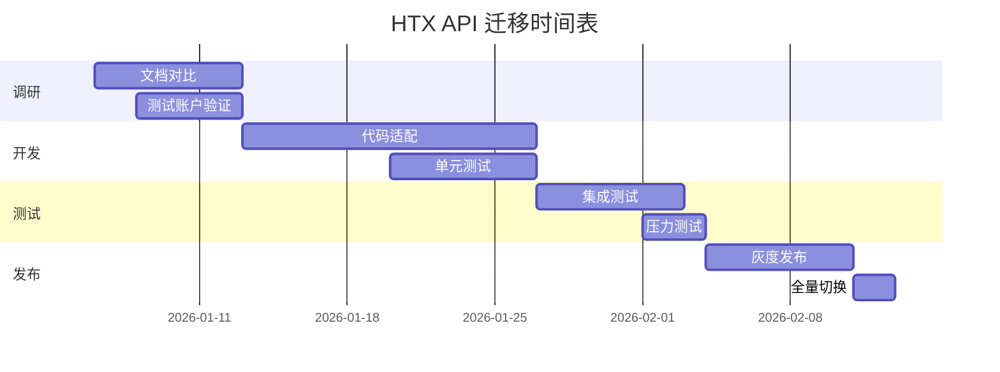

# HTX API 迁移指南

## 📋 概述

本文档说明如何将 NOFX 项目从 Huobi 旧版 API 迁移到 HTX 新版 API。

---

## 🔍 版本对比

### 旧版 API (当前使用)

- **品牌名称**: Huobi (火币)
- **API 域名**: `api.huobi.pro`
- **文档地址**: https://huobiapi.github.io/docs/usdt_swap/v1/cn/
- **API 路径**: `/linear-swap-api/v1/*`
- **状态**: ⚠️ 可能逐步弃用

### 新版 API (推荐迁移)

- **品牌名称**: HTX
- **API 域名**: `api.htx.com`
- **文档地址**: https://www.htx.com/zh-cn/opend/newApiPages/?type=2
- **API 路径**: 需要对照新文档确认
- **状态**: ✅ 官方主推，持续更新

---

## ⚠️ 迁移风险评估

### 高风险项

1. **域名变更**: `api.huobi.pro` → `api.htx.com`

   - 影响：所有 API 请求地址
   - 风险：如果旧域名停止服务，所有交易功能将失效

2. **接口路径变化**

   - 可能性：部分接口路径、参数名称可能有变化
   - 风险：需要逐个接口测试验证

3. **签名算法变化**
   - 可能性：签名方式可能有调整
   - 风险：如果签名不正确，所有私有接口将无法调用

### 中风险项

4. **响应格式变化**

   - 可能性：JSON 响应字段名称或结构可能调整
   - 风险：解析错误导致数据获取失败

5. **错误码变化**
   - 可能性：错误码定义可能有更新
   - 风险：错误处理逻辑失效

### 低风险项

6. **限频规则变化**
   - 可能性：新版 API 可能有更高或更低的限频
   - 风险：超限或性能下降

---

## 📝 迁移步骤

### 阶段 1：调研验证（1-2 周）

#### 1.1 文档对比

**任务清单**:

- [ ] 对比新旧版本所有使用的接口
- [ ] 确认接口路径是否有变化
- [ ] 确认参数名称和格式是否一致
- [ ] 确认响应格式是否一致

**需要对比的接口**:

| 功能     | 旧版路径                                     | 新版路径  | 状态 |
| -------- | -------------------------------------------- | --------- | ---- |
| 账户信息 | `/linear-swap-api/v1/swap_account_info`      | ❓ 待确认 | ⏳   |
| 持仓信息 | `/linear-swap-api/v1/swap_position_info`     | ❓ 待确认 | ⏳   |
| 下单     | `/linear-swap-api/v1/swap_order`             | ❓ 待确认 | ⏳   |
| 撤单     | `/linear-swap-api/v1/swap_cancel`            | ❓ 待确认 | ⏳   |
| 订单查询 | `/linear-swap-api/v1/swap_order_info`        | ❓ 待确认 | ⏳   |
| 挂单查询 | `/linear-swap-api/v1/swap_openorders`        | ❓ 待确认 | ⏳   |
| 计划委托 | `/linear-swap-api/v1/swap_trigger_order`     | ❓ 待确认 | ⏳   |
| 杠杆设置 | `/linear-swap-api/v1/swap_switch_lever_rate` | ❓ 待确认 | ⏳   |
| 合约信息 | `/linear-swap-api/v1/swap_contract_info`     | ❓ 待确认 | ⏳   |
| 财务记录 | `/linear-swap-api/v1/swap_financial_record`  | ❓ 待确认 | ⏳   |

#### 1.2 测试账户验证

**步骤**:

1. 在 HTX 创建测试账户
2. 获取新版 API Key
3. 编写测试脚本验证新版 API 可用性
4. 对比新旧版本响应格式差异

### 阶段 2：代码适配（2-3 周）

#### 2.1 创建新版 Trader 实现

**方案 A：完全重写（推荐）**

```bash
# 创建新文件
cp trader/htx_trader.go trader/htx_trader_v2.go
```

**优点**:

- 保留旧版作为备份
- 新旧版本可以并行测试
- 回滚方便

**方案 B：原地修改**

- 直接修改 `htx_trader.go`
- 风险较高，不推荐

#### 2.2 修改配置项

**文件**: `trader/htx_trader_v2.go`

```go
// 修改前
const (
    htxBaseURL = "https://api.huobi.pro"
)

// 修改后
const (
    htxBaseURL = "https://api.htx.com"
    // 可能需要添加新的路径常量
)
```

#### 2.3 更新签名逻辑（如有变化）

**需要检查的点**:

- 签名算法是否仍然是 HMAC-SHA256？
- 签名参数顺序是否有变化？
- Timestamp 格式是否一致？
- 请求头格式是否有变化？

#### 2.4 更新接口调用

逐个修改所有 API 调用方法，确保：

- ✅ 路径正确
- ✅ 参数完整
- ✅ 响应解析正确

### 阶段 3：测试验证（1-2 周）

#### 3.1 单元测试

```bash
# 运行现有测试套件
go test -v ./trader -run TestHTX

# 添加新版 API 测试用例
# 重点测试：下单、撤单、查询功能
```

#### 3.2 集成测试

**测试环境**:

- 使用 HTX 测试网络（如果有）
- 或使用小额真实账户

**测试用例**:

1. ✅ 账户余额查询
2. ✅ 持仓信息查询
3. ✅ 开多仓（小数量）
4. ✅ 平多仓
5. ✅ 开空仓（小数量）
6. ✅ 平空仓
7. ✅ 设置止损
8. ✅ 设置止盈
9. ✅ 撤销止损止盈
10. ✅ 批量撤单

#### 3.3 压力测试

- 并发下单测试
- 高频查询测试
- 限频边界测试

### 阶段 4：灰度发布（1 周）

#### 4.1 配置开关

添加配置项控制新旧版本：

```go
// config/config.go
type ExchangeConfig struct {
    UseHTXV2 bool `json:"use_htx_v2"` // 新增：是否使用 HTX 新版 API
}
```

#### 4.2 条件路由

```go
// api/server.go
func createHTXTrader(apiKey, secretKey string, useV2 bool) Trader {
    if useV2 {
        return trader.NewHTXTraderV2(apiKey, secretKey)
    }
    return trader.NewHTXTrader(apiKey, secretKey) // 旧版
}
```

#### 4.3 监控指标

关注以下指标：

- API 调用成功率
- 响应时间
- 错误率
- 订单成交率

### 阶段 5：全量切换（1 周）

#### 5.1 数据备份

- 备份所有交易数据
- 导出当前持仓信息

#### 5.2 正式切换

```go
// 将默认值改为 true
UseHTXV2: true, // 默认使用新版 API
```

#### 5.3 清理旧代码（可选，建议延后 1-2 个月）

```bash
# 确认新版稳定后，删除旧版代码
rm trader/htx_trader.go
mv trader/htx_trader_v2.go trader/htx_trader.go
```

---

## 📌 关键注意事项

### 1. API Key 兼容性

⚠️ **重要**: 确认旧版 API Key 是否能在新版 API 使用

- **如果兼容**: 无需用户操作，直接切换
- **如果不兼容**: 需要通知用户重新生成 API Key

### 2. 交易数据连续性

- 迁移过程中确保历史订单数据完整
- 持仓信息不能丢失
- 盈亏记录需要准确

### 3. 用户通知

**建议发布公告**:

```markdown
【重要通知】HTX API 升级计划

尊敬的用户：

由于 Huobi 已升级为 HTX，我们计划在 [日期] 将交易 API
升级至 HTX 新版 API。

升级过程中可能需要您：

1. [如果需要] 重新生成 HTX API Key
2. [如果需要] 更新 API 权限设置

我们将提前通知您具体的操作步骤。

感谢您的支持！
```

---

## 🔧 技术参考

### 新版 API 文档链接

- 📗 [HTX 开放平台首页](https://www.htx.com/zh-cn/opend/)
- 📗 [U 本位合约 API](https://www.htx.com/zh-cn/opend/newApiPages/?type=2)
- 📗 [API 签名认证](https://www.htx.com/zh-cn/opend/newApiPages/?type=2#authentication)

### 测试工具

- [HTX API Telegram 群](https://t.me/htx_api) - 官方技术支持
- Postman Collection - 可以先用 Postman 测试接口

---

## 📊 迁移时间表（建议）



**总耗时**: 约 6-8 周

---

## ✅ 迁移检查清单

### 开发阶段

- [ ] 对比所有接口文档
- [ ] 创建 htx_trader_v2.go
- [ ] 更新域名和路径
- [ ] 验证签名逻辑
- [ ] 更新所有接口方法
- [ ] 添加单元测试
- [ ] 代码审查通过

### 测试阶段

- [ ] 单元测试 100% 通过
- [ ] 集成测试 10 个用例通过
- [ ] 压力测试无异常
- [ ] 错误处理验证完成
- [ ] 文档更新完成

### 发布阶段

- [ ] 添加配置开关
- [ ] 灰度 10% 用户 7 天无异常
- [ ] 灰度 50% 用户 3 天无异常
- [ ] 全量切换
- [ ] 监控指标正常 3 天
- [ ] 清理旧代码

---

## 🆘 回滚计划

如果迁移后出现严重问题，按以下步骤回滚：

### 紧急回滚（5 分钟内）

```go
// 立即切换回旧版
config.ExchangeConfig{
    UseHTXV2: false, // 切换回旧版
}
```

### 数据恢复

1. 检查持仓信息是否一致
2. 对比余额数据
3. 验证订单状态
4. 恢复所有止损止盈设置

---

## 📞 联系方式

如有技术问题，请联系：

- HTX 官方支持: htxsupport@htx-inc.com
- HTX API Telegram: https://t.me/htx_api

---

**最后更新**: 2026-01-05  
**文档版本**: v1.0
