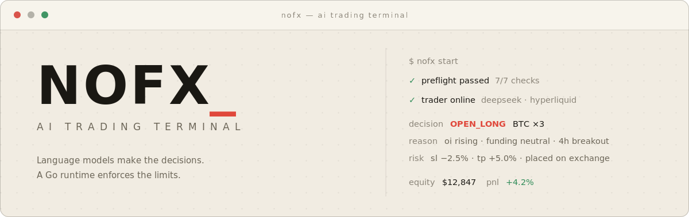
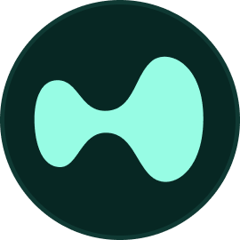
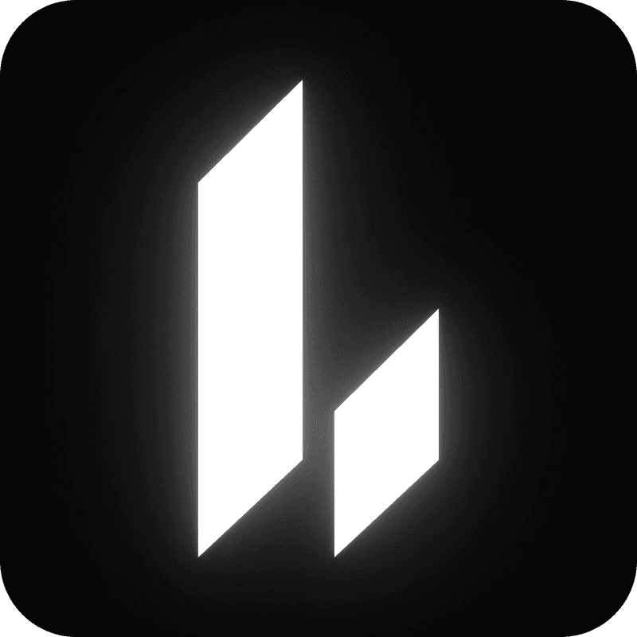
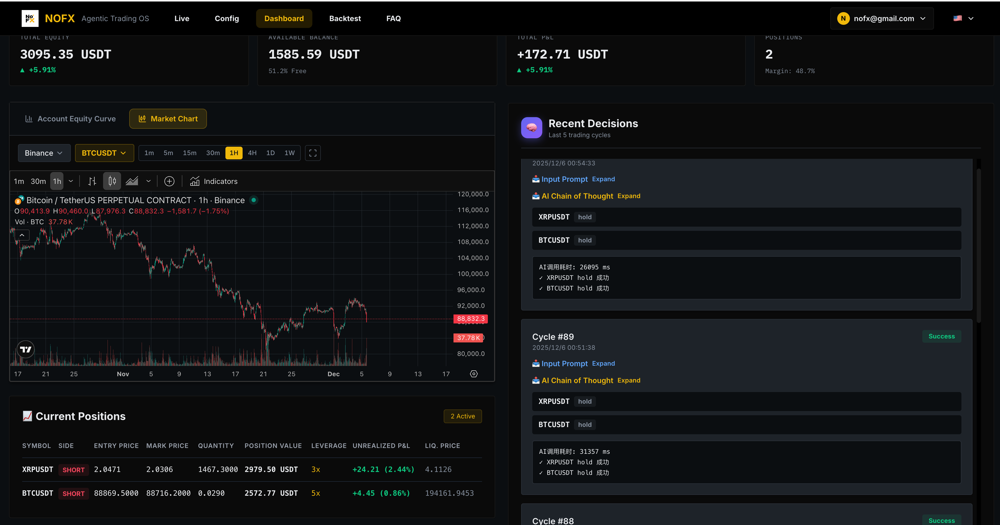
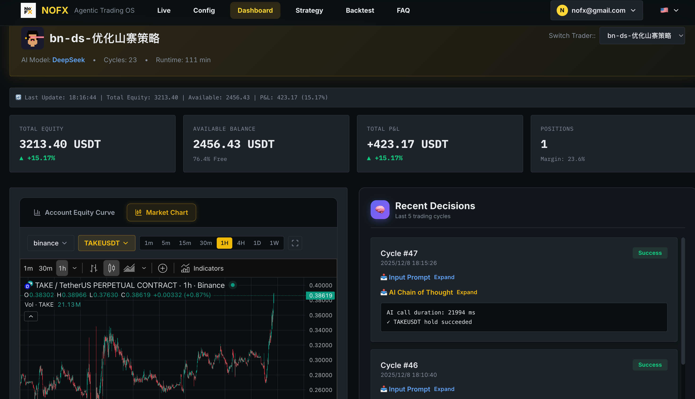
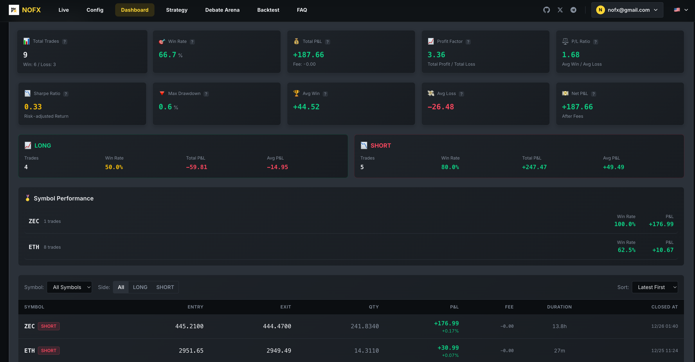
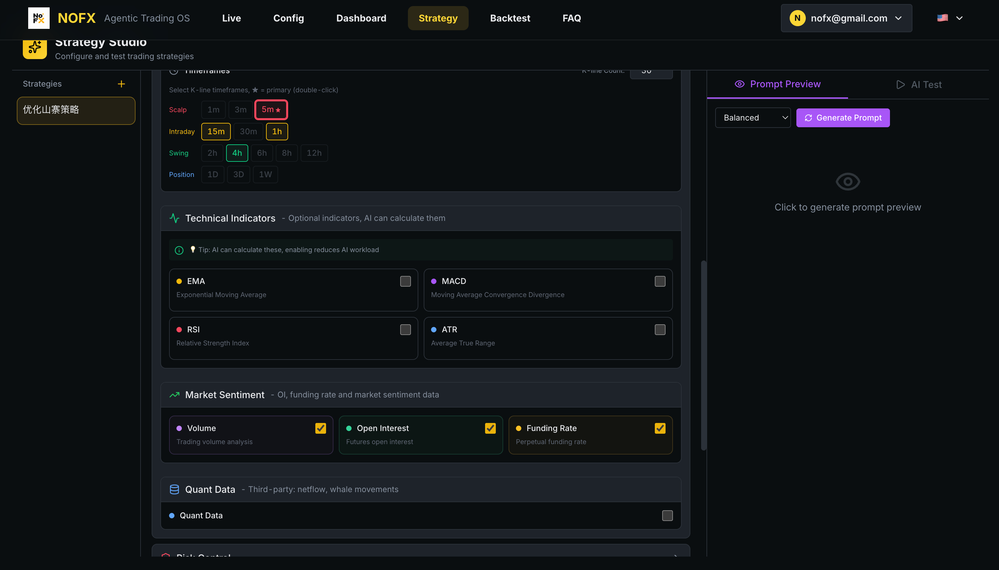
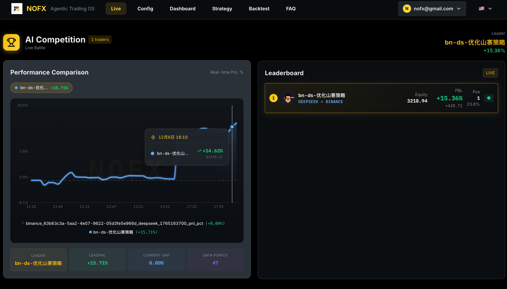
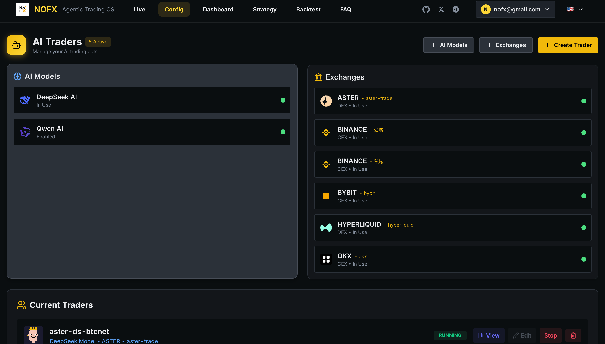

<p align="center"><strong>Được hậu thuẫn bởi <a href="https://vergex.trade">vergex.trade</a></strong></p>

<p align="center">
  
</p>

<p align="center">
  <a href="https://github.com/NoFxAiOS/nofx/stargazers"></a>
  <a href="https://github.com/NoFxAiOS/nofx/releases"></a>
  <a href="https://github.com/NoFxAiOS/nofx/blob/main/LICENSE"></a>
  <a href="https://t.me/nofx_dev_community"></a>
</p>

<p align="center">
  <a href="../../../README.md">English</a> ·
  <a href="../zh-CN/README.md">中文</a> ·
  <a href="../ja/README.md">日本語</a> ·
  <a href="../ko/README.md">한국어</a> ·
  <a href="../ru/README.md">Русский</a> ·
  <a href="../uk/README.md">Українська</a> ·
  <a href="README.md">Tiếng Việt</a>
</p>

<br/>

NOFX là một terminal giao dịch mã nguồn mở, nơi chiến lược chính là một mô hình ngôn ngữ. Mỗi trader chạy một vòng lặp liên tục — đọc cấu trúc thị trường, ra quyết định, thực thi, ghi lại lập luận — trong khi một runtime viết bằng Go ép mọi lệnh vào các giới hạn rủi ro cứng mà mô hình không thể vượt qua.

Trader được kết hợp tự do: bất kỳ mô hình nào, bất kỳ sàn nào trong chín sàn, bất kỳ chiến lược nào. Chạy nhiều trader song song và so sánh chúng trên bảng xếp hạng công khai theo lợi nhuận đã thực hiện. Mọi thứ chạy trên máy của chính bạn; thông tin xác thực sàn được mã hóa khi lưu trữ và không bao giờ rời khỏi máy.

```bash
curl -fsSL https://raw.githubusercontent.com/NoFxAiOS/nofx/main/install.sh | bash
```

Terminal mở tại `http://127.0.0.1:3000`.

**Lần chạy đầu tiên**

1. Đăng ký — tài khoản đầu tiên trở thành chủ sở hữu của instance.
2. Làm theo quy trình khởi chạy có hướng dẫn: nạp **$1+ USDC** (mạng Base) vào ví phí AI được tạo sẵn cho bạn, sau đó kết nối Hyperliquid và nạp **$12+ USDC** để giao dịch.
3. Khởi động **Autopilot**. AI quét thị trường vài phút một lần và tự mình giao dịch; mọi quyết định hiện lên dashboard ngay khi diễn ra. Dừng lại bất cứ lúc nào chỉ với một cú nhấp.

<br/>

## Đăng ký sàn giao dịch

NOFX miễn phí và mã nguồn mở. Mở tài khoản qua các liên kết đối tác bên dưới sẽ được giảm phí giao dịch và góp phần tài trợ cho việc phát triển lâu dài.

| Sàn giao dịch                                                                                                                      | Trạng thái | Đăng ký kèm ưu đãi phí                                                          |
| :---------------------------------------------------------------------------------------------------------------------------- | :----: | :---------------------------------------------------------------------------------- |
|  **Binance**       |   ✅   | [Đăng ký](https://www.binance.com/join?ref=NOFXENG)                                |
|  **Bybit**           |   ✅   | [Đăng ký](https://partner.bybit.com/b/83856)                                       |
|  **OKX**               |   ✅   | [Đăng ký](https://www.okx.com/join/1865360)                                        |
|  **Hyperliquid** |   ✅   | [Đăng ký](https://app.hyperliquid.xyz/join/AITRADING)                              |
|  **Bitget**         |   ✅   | [Đăng ký](https://www.bitget.com/referral/register?from=referral&clacCode=c8a43172) |
|  **KuCoin**         |   ✅   | [Đăng ký](https://www.kucoin.com/r/broker/CXEV7XKK)                                |
|  **Gate**             |   ✅   | [Đăng ký](https://www.gatenode.xyz/share/VQBGUAxY)                                 |
|  **Aster**           |   ✅   | [Đăng ký](https://www.asterdex.com/en/referral/fdfc0e)                             |
|  **Lighter**       |   ✅   | [Đăng ký](https://app.lighter.xyz/?referral=68151432)                              |

<br/>

## Demo

https://github.com/user-attachments/assets/3310f495-14c5-4586-a1cc-3d32e44aa505

<br/>

## Mô hình đề xuất. Runtime định đoạt.

Các quyết định đến từ một mô hình ngôn ngữ đọc bộ dữ liệu [Claw402.ai](https://claw402.ai) · Vergex: bảng tín hiệu trực tiếp xếp hạng mọi thị trường theo thiên hướng và độ mạnh tín hiệu, tín hiệu chuyên sâu Signal Lab cho từng mã, bản đồ nhiệt chi phí vốn và thanh lý cho thấy "nhiên liệu" và "bức tường" của đám đông nằm ở đâu, cùng dòng tiền ròng theo thời gian thực — tất cả được đối chiếu với nến thô và thành tích thực chiến của chính trader. Việc thực thi thì không.

Mọi lệnh đều phải đi qua các giới hạn được thực thi bằng code, nằm ngoài tầm với của mô hình:

|                          |                                                                                    |
| :----------------------- | :--------------------------------------------------------------------------------- |
| Giới hạn vị thế          | Số vị thế đồng thời tối đa, giá trị danh nghĩa bị chặn theo tỷ lệ vốn, mỗi symbol chỉ một vị thế |
| Kẹp đòn bẩy          | Trần cứng áp dụng ngay khi tính khối lượng lệnh, bất kể mô hình yêu cầu gì     |
| Bảo vệ phía sàn | Stop-loss và take-profit được đặt trên sàn ngay sau mỗi lần vào lệnh     |
| Tự đóng khi rút vốn từ đỉnh      | Vị thế đang lãi nhưng để mất quá nhiều so với đỉnh sẽ bị đóng            |
| Điều tiết giao dịch         | Thời gian giữ tối thiểu, thời gian chờ vào lại theo từng symbol, giới hạn số lần vào lệnh theo chu kỳ và theo giờ |
| Chế độ an toàn                | Mô hình lỗi liên tiếp sẽ bị chặn vào lệnh mới cho đến khi mô hình hồi phục                 |
| Kiểm tra tiền khởi chạy         | Quyền truy cập mô hình, tiền trong ví, chiến lược và số dư sàn được xác minh trước khi trader được phép khởi động |

Mỗi quyết định được lưu kèm toàn bộ lập luận của mô hình. Không có vị thế nào thiếu hồ sơ lưu vết.

<br/>

## Terminal

| | |
| :--- | :--- |
| **Autopilot** | Khởi chạy có hướng dẫn: nạp phí, kết nối, nạp tiền, khởi động — với kiểm tra preflight phía máy chủ xuyên suốt |
| **Strategy Studio** | Preset phong cách, tập coin, chỉ báo, đòn bẩy, độ tin cậy vào lệnh, prompt tùy chỉnh |
| **Cạnh tranh** | Bảng xếp hạng công khai theo lợi nhuận đã thực hiện, mỗi mục được ghi nhận cho mô hình tạo ra nó |
| **Dashboard** | Vị thế trực tiếp, lệnh, thống kê và lập luận đằng sau mỗi quyết định |

<details>
<summary>Ảnh chụp màn hình</summary>

<br/>

|                        Tổng quan                         |                          Biểu đồ thị trường                           |
| :-----------------------------------------------------: | :-------------------------------------------------------------: |
|  |  |

|                          Thống kê giao dịch                           |                          Lịch sử vị thế                           |
| :--------------------------------------------------------------: | :-----------------------------------------------------------------: |
|  |  |

|                     Trình soạn chiến lược                      |                      Cấu hình chỉ báo                       |
| :------------------------------------------------------: | :----------------------------------------------------------: |
|  |  |

|                     Cạnh tranh                           |                    Cấu hình                              |
| :-------------------------------------------------------: | :-----------------------------------------------------------: |
|  |   |

</details>

<br/>

## Mô hình

Tám nhà cung cấp với key của riêng bạn — DeepSeek, OpenAI, Claude, Qwen, Gemini, Grok, Kimi, MiniMax — bao gồm cả endpoint và tên mô hình tùy chỉnh.

Hoặc không cần key nào cả: [Claw402](https://claw402.ai) tính phí sử dụng mô hình theo từng lần gọi bằng USDC qua giao thức x402. Một chiếc ví trên Base thay thế mọi API key.

| Nhà cung cấp | Truy cập |
| :------- | :----- |
| **Claw402** | [Mô hình AI trả theo mức dùng với ưu đãi chính thức](https://claw402.ai) |

## Thị trường

Hợp đồng vĩnh cửu crypto trên cả chín sàn. Trên Hyperliquid, cùng một runtime còn giao dịch cổ phiếu Mỹ token hóa, hàng hóa, chỉ số, ngoại hối và hợp đồng vĩnh cửu pre-IPO — TSLA, NVDA, GOLD, SPX, EUR, OPENAI — song song với crypto.

<br/>

## Kiến trúc

```
    ┌─────────────────────────────────────────────────┐
    │                 Trading Terminal                 │
    │        React · TypeScript · TradingView          │
    │   Dashboard · Strategy Studio · Competition      │
    ├─────────────────────────────────────────────────┤
    │                  API Server (Go)                  │
    │      JWT auth · encrypted credential store        │
    ├──────────────┬──────────────┬───────────────────┤
    │   Strategy    │  Autopilot   │   Trader Runtime  │
    │    Engine     │  Preflight   │    Risk Engine    │
    ├──────────────┴──────────────┴───────────────────┤
    │                 AI Model Layer                    │
    │  DeepSeek · OpenAI · Claude · Qwen · Gemini      │
    │  Grok · Kimi · MiniMax · Claw402 (x402 USDC)     │
    ├─────────────────────────────────────────────────┤
    │              Exchange Connectivity                │
    │ Binance · Bybit · OKX · Hyperliquid · Bitget     │
    │ KuCoin · Gate · Aster · Lighter                  │
    └─────────────────────────────────────────────────┘
```

<br/>

## Cài đặt

**Linux / macOS**

```bash
curl -fsSL https://raw.githubusercontent.com/NoFxAiOS/nofx/main/install.sh | bash
```

**Railway**

[](https://railway.com/deploy/nofx?referralCode=nofx)

**Docker**

```bash
curl -O https://raw.githubusercontent.com/NoFxAiOS/nofx/main/docker-compose.prod.yml
docker compose -f docker-compose.prod.yml up -d
```

**Windows** — cài [Docker Desktop](https://www.docker.com/products/docker-desktop/), sau đó:

```powershell
curl -o docker-compose.prod.yml https://raw.githubusercontent.com/NoFxAiOS/nofx/main/docker-compose.prod.yml
docker compose -f docker-compose.prod.yml up -d
```

**Từ mã nguồn** — Go 1.21+, Node.js 18+:

```bash
git clone https://github.com/NoFxAiOS/nofx.git && cd nofx
go build -o nofx && ./nofx            # backend
cd web && npm install && npm run dev  # frontend, in a second terminal
```

**Cập nhật** — chạy lại script cài đặt; nó tự nâng cấp tại chỗ.

<details>
<summary>Triển khai lên máy chủ</summary>

<br/>

**HTTP**

```bash
curl -fsSL https://raw.githubusercontent.com/NoFxAiOS/nofx/main/install.sh | bash
# http://YOUR_IP:3000
```

**HTTPS qua Cloudflare**

1. Thêm domain vào [Cloudflare](https://dash.cloudflare.com) (gói miễn phí)
2. Bản ghi A → IP máy chủ, bật proxy
3. SSL/TLS → Flexible
4. `TRANSPORT_ENCRYPTION=true` trong `.env`

</details>

<br/>

## Tài liệu

|                                                         |                                       |
| :------------------------------------------------------ | :------------------------------------ |
| [Bắt đầu](../../getting-started/README.md)       | Hướng dẫn triển khai và API sàn    |
| [Kiến trúc](../../architecture/README.md)             | Thiết kế hệ thống và chỉ mục module        |
| [Module chiến lược](../../architecture/STRATEGY_MODULE.md) | Chọn coin, prompt AI, thực thi |
| [FAQ](../../guides/faq.en.md)                            | Câu hỏi thường gặp                      |
| [Khắc phục sự cố](../../guides/TROUBLESHOOTING.md)       | Chẩn đoán các sự cố thường gặp              |

## Cộng đồng

[Telegram](https://t.me/nofx_dev_community) · [Twitter/X](https://x.com/vergex_ai) · [Issues](https://github.com/NoFxAiOS/nofx/issues) · [vergex.trade](https://vergex.trade) · [Dashboard trực tiếp](https://vergex.trade/explore)

## Đóng góp

Code, tài liệu, bản dịch và báo cáo lỗi đều được hoan nghênh — xem [Hướng dẫn đóng góp](../../../CONTRIBUTING.md), [Quy tắc ứng xử](../../../CODE_OF_CONDUCT.md) và [Chính sách bảo mật](../../../SECURITY.md).

NOFX theo dõi các đóng góp có ý nghĩa và dự định thưởng cho người đóng góp khi hệ sinh thái phát triển. Issue ưu tiên có trọng số cao hơn.

| Đóng góp      | Trọng số |
| :---------------- | :----: |
| PR cho issue được ghim  | ★★★★★★ |
| Code (PR đã merge) | ★★★★★  |
| Sửa lỗi         |  ★★★★  |
| Ý tưởng tính năng     |  ★★★   |
| Báo cáo lỗi       |   ★★   |
| Tài liệu     |   ★★   |

<a href="https://github.com/NoFxAiOS/nofx/graphs/contributors">
  
</a>

## Nhà tài trợ

<a href="https://github.com/pjl914335852-ux"></a>
<a href="https://github.com/cat9999aaa"></a>
<a href="https://github.com/1733055465"></a>
<a href="https://github.com/kolal2020"></a>
<a href="https://github.com/CyberFFarm"></a>
<a href="https://github.com/vip3001003"></a>
<a href="https://github.com/mrtluh"></a>
<a href="https://github.com/cpcp1117-source"></a>
<a href="https://github.com/match-007"></a>
<a href="https://github.com/leiwuhen1715"></a>
<a href="https://github.com/SHAOXIA1991"></a>

[Trở thành nhà tài trợ](https://github.com/sponsors/NoFxAiOS)

<br/>

Nếu NOFX hữu ích với bạn, một ngôi sao sẽ giúp các trader khác tìm thấy nó.

[](https://star-history.com/#NoFxAiOS/nofx&Date)

## Giấy phép

[AGPL-3.0](../../../LICENSE)

<sub>Giao dịch tự động tiềm ẩn rủi ro đáng kể. Các chiến lược do AI điều khiển mang tính thử nghiệm và có thể thua lỗ. Hãy đặt kích thước vị thế hợp lý, hiểu rõ từng sàn giao dịch, và đừng bao giờ giao dịch bằng số tiền mà bạn không thể để mất. Xem đầy đủ [tuyên bố miễn trừ trách nhiệm](../../../DISCLAIMER.md).</sub>
